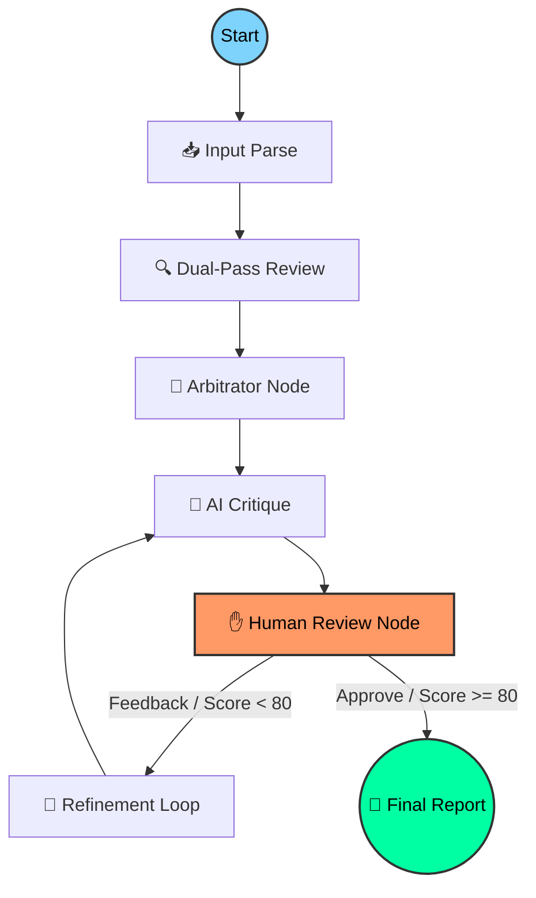

# 🤖 GitMind: The Self-Correcting AI Code Reviewer

<p align="center">
  
</p>

[](https://github.com/langchain-ai/langgraph)
[](https://angular.dev/)
[](https://fastapi.tiangolo.com/)
[](https://opensource.org/licenses/MIT)

**GitMind** is a next-generation, autonomous code review platform powered by **LangGraph** and a cyclic **Dual-Pass Reasoning Engine**. It transcends traditional static analysis by employing a multi-agent reasoning loop that mimics a senior engineer's review process—detecting vulnerabilities, suggesting performance optimizations, and refining its own logic based on AI critique and human feedback.

---

## ⚡ Why GitMind?

GitMind solves the "one-shot" AI hallucination problem through a multi-perspective, stateful reasoning process:

- **🧠 Dual-Pass Review:** Simultaneously runs a **Security Auditor** pass and a **Quality Engineer** pass, merging them through a senior **Arbitrator** node.
- **✋ Human-in-the-Loop (HITL):** Built-in interruption points allow developers to steer the agent mid-process or correct its trajectory.
- **📋 Repo-Aware Configuration:** Support for `.gitmind.yaml` config files directly in your repository to define custom rules, ignored paths, and severity thresholds.
- **💬 Discussion-Aware:** Fetches existing human discussion from GitHub PRs to ensure the agent doesn't repeat or contradict what has already been discussed.
- **💾 Stateful History:** SQLite-backed persistence for both execution threads and analysis history, allowing you to browse past reviews.
- **🚀 Smart Diff Chunking:** Prioritizes critical source code over non-functional files to ensure the most important changes fit within model context limits.

---

## 🧠 Core Intelligence: The Reasoning Loop

GitMind's orchestration is managed by **LangGraph**, providing a robust framework for complex, cyclic reasoning paths.



### The 7-Stage Pipeline:
1.  **Input Parse:** Fetches diffs, loads `.gitmind.yaml` config, and builds a prioritized, structured context.
2.  **Dual-Pass Review:** Concurrent execution of a **Security Auditor** (vulnerabilities) and a **Quality Engineer** (performance/clean code).
3.  **Arbitrator:** Merges both passes, deduplicates findings, and assigns a final cross-perspective confidence score.
4.  **AI Critique:** A dedicated "Critic" agent checks the report for hallucinations and tone accuracy.
5.  **Human Interruption:** The graph pauses, allowing developers to provide `human_feedback` via the UI.
6.  **Refinement:** The "Refiner" agent reconciles arbitrated findings with AI critique and human input.
7.  **Auto-Save:** Successfully completed reviews are automatically persisted to the SQLite history database.

---

## 🚀 Key Features & Capabilities

| Feature | Technical Implementation |
| :--- | :--- |
| **Cognitive Core** | Dual-Pass review (Security + Quality) followed by LLM-based Arbitration. |
| **Smart Priority** | Automated diff prioritization favoring source files over lock/doc files. |
| **Stateful Memory** | `MemorySaver` and `SqliteSaver` for persistent execution and history. |
| **Discussion-Aware** | Integrated PR comment fetching via GitHub REST API to enrich context. |
| **Configurable** | Support for `.gitmind.yaml` for project-specific ignore paths and rules. |
| **Reactive UI** | **Angular 20 Signals** with a real-time SSE stream for agent "monologue". |
| **Native Feedback** | Interactive "Push Suggestion" buttons for direct GitHub PR/Commit commenting. |

---

## 🛠 Configuration (.gitmind.yaml)

You can place a `.gitmind.yaml` file in the root of your repository to customize the review experience:

```yaml
# GitMind Project Configuration
model: "gemini-2.0-flash-pro"
provider: "gemini"
severity_threshold: "medium" # Report only medium and high issues
ignore_paths:
  - "dist/**"
  - "*.test.ts"
  - "migrations/"
custom_instructions: |
  We follow strict Functional Programming principles. 
  Flag any use of mutable state or 'let' keywords.
```

---

## 📂 Project Architecture

```text
GitMind/
├── backend/                # FastAPI Application
│   ├── agent.py            # LangGraph Core & Node Logic (7-node pipeline)
│   ├── main.py             # SSE Endpoints, History & Comment Controllers
│   ├── config_loader.py    # .gitmind.yaml Parsing & Validation
│   ├── diff_parser.py      # Smart Chunking & File Prioritization
│   ├── github_context.py   # PR Comment & Context Fetching
│   ├── history.py          # SQLite Persistence Layer for Analysis History
│   ├── schemas.py          # Pydantic State & Report Definitions
│   └── requirements.txt    # Async-optimized deps (PyYAML, Tenacity)
├── frontend/               # Angular 20 Application
│   ├── src/app/            # Signal-based Reactive Components
│   ├── src/styles.css      # Custom Cyberpunk Theme & Gutter Styling
│   └── package.json        # Frontend Toolchain
└── README.md               # Documentation
```

---

## ⚙️ Installation & Setup

### 1. Prerequisites
- **Python:** 3.10+
- **Node.js:** 20+
- **NPM:** 10+

### 2. Backend Setup
```bash
cd backend
python -m venv venv
source venv/bin/activate
pip install -r requirements.txt
python main.py
```

### 3. Frontend Setup
```bash
cd frontend
npm install
npm start
```
Navigate to `http://localhost:4200` to start your first review.

---

## 🤝 Contributing & Community

We are building the future of autonomous software engineering. Join us!
1. Fork the repository.
2. Create your feature branch (`git checkout -b feat/advanced-review`).
3. Commit your changes (`git commit -m 'feat: add amazing thing'`).
4. Push to the branch (`git push origin feat/advanced-review`).
5. Open a Pull Request.

---
*Developed with 🚀 by the GitMind Team. Empowering developers through intelligent automation.*
