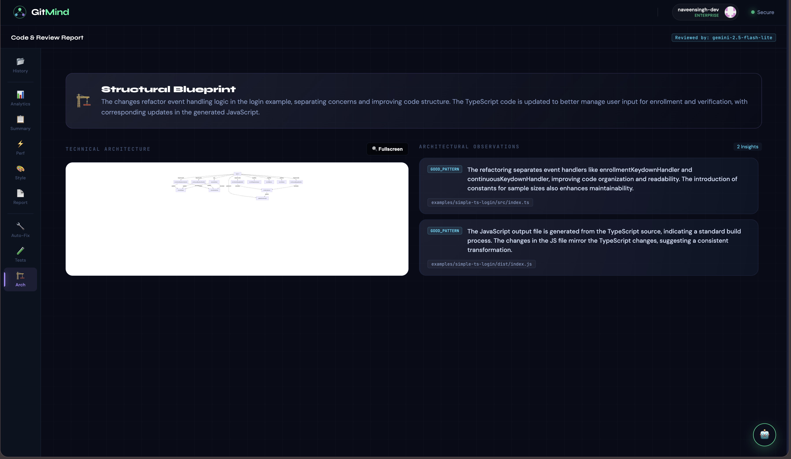
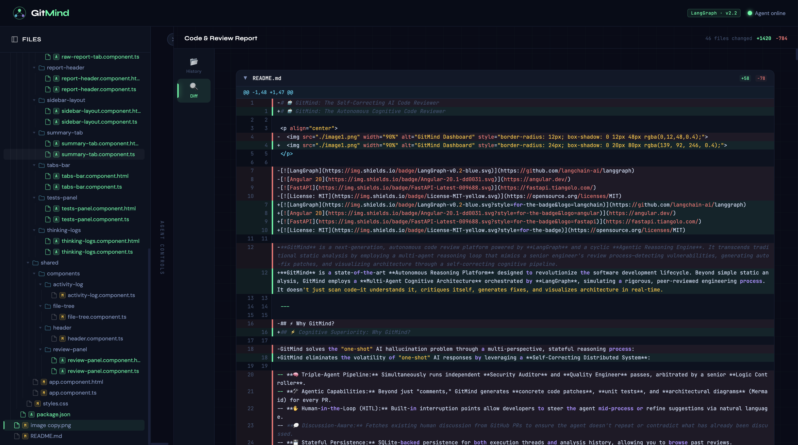
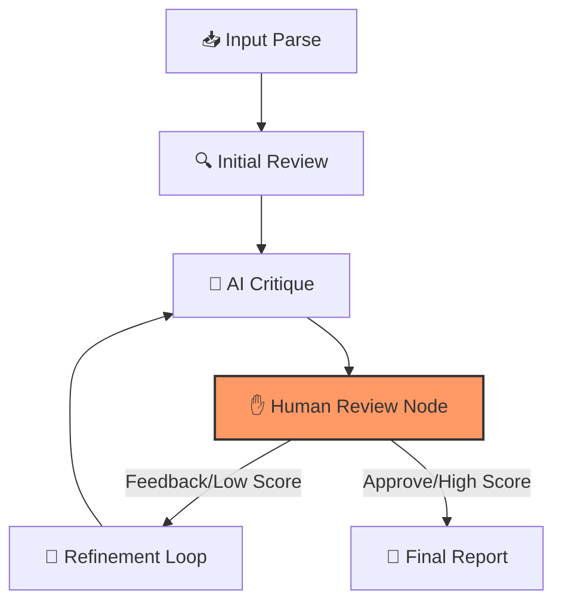

# 🤖 GitMind: Self-Correcting AI Code Reviewer

[](https://github.com/langchain-ai/langgraph)
[](https://angular.dev/)
[](https://fastapi.tiangolo.com/)
[](https://opensource.org/licenses/MIT)
[](https://colab.research.google.com/github/langchain-ai/langgraph/blob/main/docs/docs/tutorials/introduction.ipynb)

**GitMind** is an advanced, autonomous code review agent built on a cyclic **Self-Critique & Refinement** architecture with **Human-in-the-Loop** (HITL) capabilities. It leverages a state-machine based reasoning loop to analyze code changes, critique its own findings, and refine suggestions before presentation.

---

## 📸 Platform Overview

### Autonomous Reasoning in Action

*Figure 1: Real-time pipeline execution showing the internal monologue and active state machine transitions.*

### High-Fidelity Categorized Reports

*Figure 2: Final analysis showing the "Reviewed by" system, structured diff navigation, and categorized severity cards.*

---

## 🧠 Core Intelligence Engine: The Reasoning Loop

GitMind operates using a **Cyclic Directed Acyclic Graph (DAG)** powered by **LangGraph**. The agent doesn't just "read and reply"; it follows a rigorous 5-stage cognitive process that allows for iterative improvement.



1.  **📥 Input Parse:** Fetches and tokenizes raw diffs directly from GitHub URLs or manual input.
2.  **🔍 Initial Review:** Conducts a broad-spectrum analysis focusing on Security, Performance, and Style.
3.  **🧠 AI Critique:** A dedicated "critic" node evaluates the review for hallucinations, factual accuracy, and professional tone, assigning a quality score.
4.  **✋ Human-in-the-Loop (HITL):** The engine **interrupts** and waits for human feedback. You can correct the agent, ask for deeper focus, or approve the current progress.
5.  **🔄 Refinement Loop:** If the score is < 80/100 or if human feedback is provided, the agent rebuilds the review to incorporate all insights.

---

## 🚀 Key Features

- **⚡ Multi-Provider Core:** 
    - **Google Gemini:** Optimized for `gemini-2.0-flash` (Research Tier) and `1.5-pro`.
    - **Tier 1 Models:** Full support for `gpt-4o`, `claude-3-5-sonnet`, and `o3-mini`.
    - **DeepSeek & Groq:** High-speed inference for near-instant critiques.
- **📂 Intelligent Navigation:** A new **Signal-based File Tree** component allows you to navigate large PRs with ease.
- **💾 State Persistence:** Uses **LangGraph Checkpointers** (MemorySaver) to maintain session state even across server restarts.
- **🌐 CORS-Free Proxy:** A dedicated FastAPI backend handles GitHub authentication and diff streaming to bypass browser restrictions.
- **🎨 Zoneless Angular UI:** Built with **Angular 20 Signals** for maximum performance and a reactive, zero-latency user experience.
- **🧠 Critic's Corner:** Transparent view into the agent's self-correction process and quality scoring.
- **📊 Real-time SSE Streaming:** Live updates from the LangGraph engine directly to the UI.

---

## 🛠 Tech Stack

| Layer | Technology | Description |
| :--- | :--- | :--- |
| **Frontend** | Angular 20 (Signals, Zoneless) | High-performance reactive UI |
| **Backend** | FastAPI (Python 3.10+) | Async high-concurrency API layer |
| **Agent Logic**| LangGraph | State machine & HITL interruption |
| **LLM Gateway**| LangChain | Provider-agnostic abstraction |
| **Memory**     | MemorySaver | Checkpointing for persistent session state |
| **Styling**    | Tailwind-inspired CSS | Custom Cyberpunk / GitHub-Dark theme |

---

## 📂 Project Structure

```text
GitMind/
├── backend/                # Python/FastAPI Backend
│   ├── agent.py            # LangGraph workflow & node definitions
│   ├── main.py             # FastAPI entry point & SSE streaming
│   ├── prompts.py          # Expert System Prompts (Reviewer/Critic/Refiner)
│   ├── schemas.py          # Pydantic models for Agent State & Reports
│   └── requirements.txt    # Python dependencies
├── frontend/               # Angular Frontend
│   ├── src/app/            # Components (FileTree, ActivityLog, etc.)
│   ├── src/styles.css      # Custom styling & theme
│   └── package.json        # Frontend dependencies
└── README.md               # Documentation
```

---

## ⚙️ Installation & Setup

### 1. Prerequisites
- **Python:** 3.10 or higher
- **Node.js:** 20.x or higher
- **NPM:** 10.x or higher

### 2. Backend Configuration
1. Navigate to the backend directory:
   ```bash
   cd backend
   ```
2. Create and activate a virtual environment:
   ```bash
   python -m venv venv
   source venv/bin/activate  # Windows: venv\Scripts\activate
   ```
3. Install dependencies:
   ```bash
   pip install -r requirements.txt
   ```
4. Configure environment variables:
   ```bash
   cp .env.example .env
   # Open .env and add your API keys (GOOGLE_API_KEY, etc.)
   ```
5. Launch the server:
   ```bash
   python main.py
   ```

### 3. Frontend Configuration
1. Navigate to the frontend directory:
   ```bash
   cd frontend
   ```
2. Install dependencies:
   ```bash
   npm install
   ```
3. Start the development server:
   ```bash
   npm start
   ```
4. Access the UI at `http://localhost:4200`.

---

## 🗺 Roadmap to Version 2.0

### Phase 1: Actionable Feedback
- [ ] **Line-Level PR Comments:** Post findings directly to GitHub using the REST API.
- [ ] **GitHub Checks Integration:** Fail builds if high-severity issues are found.
- [ ] **OAuth2 Flow:** Secure authentication for GitHub integration.

### Phase 2: Deep Repository Context (RAG)
- [ ] **Contextual File Fetching:** Automatically analyze imported files for better type-safety checks.
- [ ] **Local Repository Indexing:** Use ChromaDB for full-codebase awareness.

### Phase 3: Automated Patch Generation
- [ ] **One-Click Fixes:** Generate "Suggested Changes" directly in the PR.
- [ ] **UI Diff Preview:** Side-by-side view for AI-proposed fixes.

---

## 🤝 Contributing

We welcome contributions! Please follow these steps:
1. Fork the repository.
2. Create a new branch (`git checkout -b feature/your-feature`).
3. Commit your changes (`git commit -m 'Add some feature'`).
4. Push to the branch (`git push origin feature/your-feature`).
5. Open a Pull Request.

---

## 📄 License

This project is licensed under the MIT License - see the [LICENSE](LICENSE) file for details.

---
*Built with ❤️ for the future of automated software engineering.*
