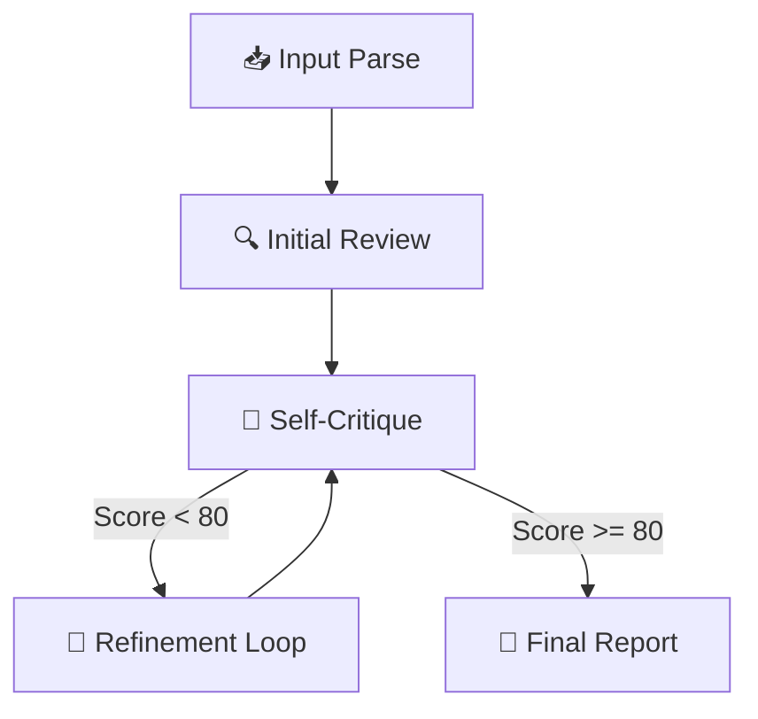

# 🤖 GitMind: Self-Correcting AI Code Reviewer

[](https://github.com/langchain-ai/langgraph)
[](https://angular.dev/)
[](https://fastapi.tiangolo.com/)
[](https://opensource.org/licenses/MIT)

**GitMind** is an advanced, autonomous code review agent built on a cyclic **Self-Critique & Refinement** architecture. Unlike standard linear AI prompts, GitMind uses a state-machine based reasoning loop to analyze GitHub PRs, critique its own findings, and refine its suggestions before presenting them to the developer.

---

## 📸 Platform Overview

### Autonomous Reasoning in Action

*Figure 1: Real-time pipeline execution showing the internal monologue and active state machine transitions.*

### High-Fidelity Categorized Reports

*Figure 2: Final analysis showing the "Reviewed by" system, structured diff navigation, and categorized severity cards.*

---

## 🧠 Core Intelligence Engine

GitMind operates using a **Cyclic Directed Acyclic Graph (DAG)** powered by **LangGraph**. The agent doesn't just "read and reply"; it follows a rigorous 4-stage cognitive process:



1.  **📥 Input Parse:** Dynamically fetches and tokenizes raw diffs directly from GitHub.
2.  **🔍 Initial Review:** Conducts a broad-spectrum analysis (Security, Performance, Style).
3.  **🧠 Self-Critique:** A separate "critic" node evaluates the review for hallucinations, factual accuracy, and professional tone.
4.  **🔄 Refinement Loop:** If the critique score is < 80/100, the agent triggers a refinement node to rebuild the review based on the critic's feedback.

---

## 🚀 Key Features

*   **⚡ Multi-Provider Architecture:** 
    *   **Google Gemini:** `gemini-2.0-flash`, `gemini-1.5-pro`, etc.
    *   **OpenAI:** `gpt-4o`, `gpt-4o-mini`, `o3-mini`.
    *   **Anthropic:** `claude-3-5-sonnet`.
    *   **DeepSeek & Groq:** Low-latency inference for high-speed reviews.
*   **💾 State Persistence:** Remembers your preferred models and API keys across sessions using secure `localStorage`.
*   **🌐 CORS-Free Proxy:** A dedicated FastAPI backend handles GitHub authentication and diff streaming to bypass browser restrictions.
*   **🎨 Advanced UI:** Zoneless Angular architecture with a high-fidelity GitHub-dark theme, real-time SSE (Server-Sent Events) logging, and syntax-highlighted diffs.
*   **🧠 Critic's Corner:** Transparent view into the agent's self-correction process and quality scoring.

---

## 🛠 Tech Stack

| Component | Technology | Role |
| :--- | :--- | :--- |
| **Frontend** | Angular 20 (Signals, Zoneless) | Reactive UI & State Management |
| **Backend** | FastAPI (Async) | High-concurrency SSE Streaming |
| **Orchestration** | LangGraph | State machine & cyclic agent logic |
| **LLM Framework** | LangChain | Multi-provider abstraction layer |
| **Visuals** | Marked.js | Professional Markdown rendering |

---

## 📂 Project Structure

```text
GitMind/
├── backend/                # FastAPI + LangGraph Logic
│   ├── agent.py            # LangGraph workflow definition
│   ├── main.py             # FastAPI entry point & SSE streaming
│   ├── prompts.py          # System prompts for Reviewer/Critic/Refiner
│   ├── schemas.py          # Pydantic models for type-safe state
│   └── requirements.txt    # Python dependencies
├── frontend/               # Angular 20 Application
│   ├── src/app/            # Component & Service logic
│   ├── src/styles.css      # Custom Cyberpunk/GitHub-Dark theme
│   └── package.json        # Frontend dependencies
└── README.md               # Documentation
```

---

## ⚙️ Installation & Setup

### 1. Prerequisites
- Python 3.10+
- Node.js 20+
- A valid API Key (Gemini, OpenAI, or Anthropic)

### 2. Backend Setup
```bash
cd backend
python -m venv venv
source venv/bin/activate  # Windows: venv\Scripts\activate
pip install -r requirements.txt
cp .env.example .env
# Edit .env with your keys
python main.py
```

### 3. Frontend Setup
```bash
cd frontend
npm install
npm start
```

---

## 🔐 Environment Variables

Configure your `backend/.env` to enable multiple providers:

```env
# Google Gemini (Primary)
GOOGLE_API_KEY=your_key_here

# Optional Providers
OPENAI_API_KEY=your_key_here
ANTHROPIC_API_KEY=your_key_here
DEEPSEEK_API_KEY=your_key_here
GROQ_API_KEY=your_key_here
```

---

## 📄 License

This project is licensed under the MIT License - see the [LICENSE](LICENSE) file for details.

---
*Built with ❤️ for the future of automated software engineering.*
