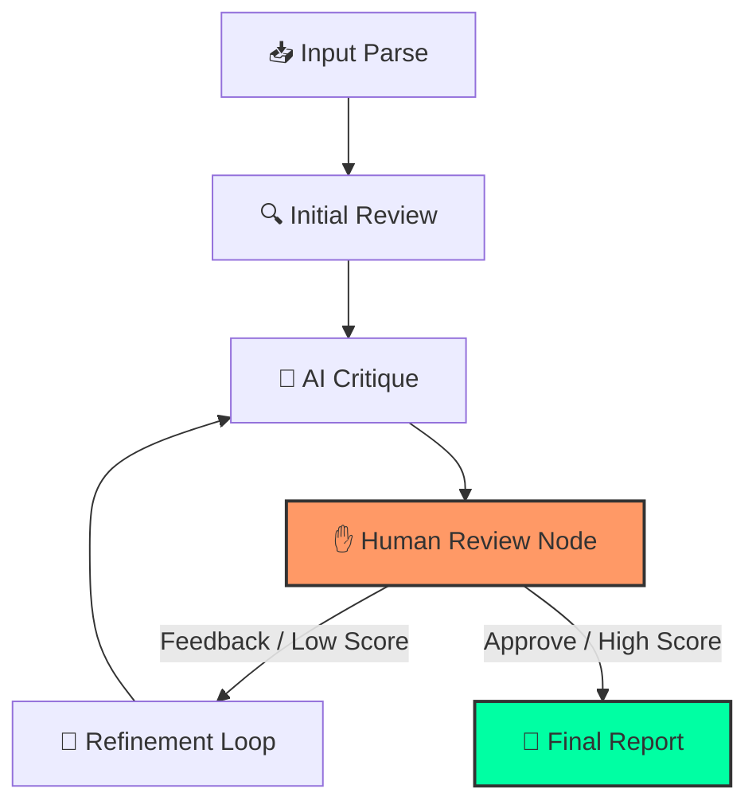

# 🤖 GitMind: The Self-Correcting AI Code Reviewer

<p align="center">
  
</p>

[](https://github.com/langchain-ai/langgraph)
[](https://angular.dev/)
[](https://fastapi.tiangolo.com/)
[](https://opensource.org/licenses/MIT)

**GitMind** is a state-of-the-art, autonomous code review agent built on a cyclic **Self-Critique & Refinement** architecture. Unlike static analysis tools, GitMind uses a multi-agent reasoning loop to analyze code, critique its own findings, and incorporate human feedback—resulting in high-fidelity, actionable reviews that feel like they came from a senior engineer.

---

## ⚡ Why GitMind?

Most AI tools provide a "one-shot" response that can be prone to hallucinations or generic advice. GitMind solves this through:

- **🧠 Multi-Agent Reasoning:** Separate "Reviewer," "Critic," and "Refiner" nodes collaborate to ensure accuracy.
- **✋ Human-in-the-Loop:** The agent pauses and waits for your input, allowing you to steer the analysis.
- **💾 Long-Term Persistence:** Every session is backed by a SQLite-powered checkpointer, so your review state is never lost.
- **🚀 Real-Time Execution:** Watch the agent "think" through a live SSE stream of its internal monologue.
- **🛠 GitHub Native:** Post suggestions directly to PRs as "Suggested Changes" with a single click.

---

## 🧠 Core Intelligence: The Cognitive Loop

GitMind's brain is a **Cyclic Directed Acyclic Graph (DAG)** orchestrated by **LangGraph**. This allows the agent to iteratively improve its output until it meets a high quality threshold.



### The 5-Stage Reasoning Process:
1.  **📥 Input Parse:** Deeply tokenizes PR diffs from GitHub URLs or raw patches.
2.  **🔍 Initial Review:** Analyzes the code for **Security**, **Performance**, and **Style** using specialized system prompts.
3.  **🧠 AI Critique:** A dedicated "Critic" evaluates the review's accuracy and assign a quality score (0-100).
4.  **✋ Human-in-the-Loop (HITL):** The system **interrupts execution** and waits for your feedback. You can correct the agent's path or ask for more focus on specific files.
5.  **🔄 Refinement Loop:** If the score is low or human feedback is provided, the "Refiner" node rebuilds the entire report to ensure professional-grade quality.

---

## 🚀 Key Features

| Feature | Description |
| :--- | :--- |
| **⚡ Multi-Model Support** | Switch between Gemini 2.0/1.5, GPT-4o, Claude 3.7, DeepSeek V3/R1, and Groq Llama/Mixtral instantly. |
| **💬 Live PR Comments** | Integration with GitHub API to post line-level suggestions as "Suggested Changes" formatted blocks. |
| **📂 Signal-Based File Tree**| A high-performance, reactive file tree for navigating large diffs with zero latency. |
| **🗄 SQLite Persistence** | Powered by `SqliteSaver`, the agent remembers the full state of every review across server restarts. |
| **🔒 Sanitized Markdown** | Beautifully rendered, syntax-highlighted reports protected by DOMPurify. |
| **🎨 Cyberpunk UI** | A modern, dark-themed UI built with Angular 20 Signals for a smooth, app-like experience. |

---

## 🛠 Tech Stack

- **Frontend:** Angular 20 (Signals, Zoneless), Highlight.js, DOMPurify, Marked.
- **Backend:** FastAPI, Python 3.10+, LangGraph, LangChain.
- **Persistence:** SQLite3 via `langgraph-checkpoint-sqlite`.
- **AI Connectivity:** Google Generative AI, OpenAI SDK, Anthropic SDK, Tenacity (for robust retries).

---

## ⚙️ Installation & Setup

### 1. Prerequisites
- **Python:** 3.10+
- **Node.js:** 20+
- **NPM:** 10+

### 2. Backend Setup
```bash
cd backend
python -m venv venv
source venv/bin/activate # Windows: venv\Scripts\activate
pip install -r requirements.txt
cp .env.example .env     # Add your API keys (GOOGLE_API_KEY, etc.)
python main.py
```

### 3. Frontend Setup
```bash
cd frontend
npm install
npm start
```
Access the application at `http://localhost:4200`.

---

## 📂 Project Architecture

```text
GitMind/
├── backend/                # FastAPI Application
│   ├── agent.py            # LangGraph Core & Persistence Logic
│   ├── main.py             # SSE Endpoints & GitHub API Integration
│   ├── prompts.py          # AI Reasoning Instructions
│   ├── schemas.py          # Pydantic State & Report Models
│   └── requirements.txt    # Python Dependencies
├── frontend/               # Angular Application
│   ├── src/app/            # Reactive UI Components
│   ├── src/styles.css      # Custom Cyberpunk Theme
│   └── package.json        # Node Dependencies
└── README.md               # You are here
```

---

## 🗺 Roadmap to v2.0

- [x] **v1.2: Persistent State** - SQLite-backed sessions.
- [x] **v1.5: GitHub Write Access** - Post comments directly to PRs.
- [ ] **v1.8: OAuth2 Integration** - Secure, multi-user GitHub authentication.
- [ ] **v2.0: Contextual RAG** - Index entire repositories for deep architectural awareness.

---

## 🤝 Contributing

We love contributions!
1. Fork the repo.
2. Create your feature branch (`git checkout -b feat/cool-feature`).
3. Commit your changes (`git commit -m 'feat: add cool thing'`).
4. Push to the branch (`git push origin feat/cool-feature`).
5. Open a Pull Request.

---
*Built with ❤️ for the next generation of software quality.*
