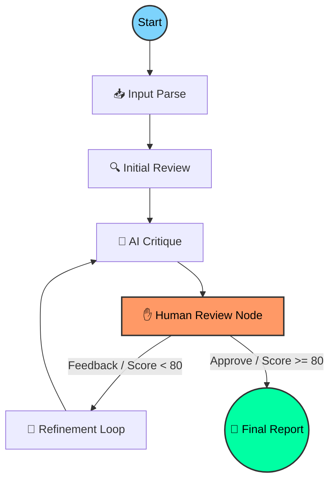

# 🤖 GitMind: The Self-Correcting AI Code Reviewer

<p align="center">
  
</p>

[](https://github.com/langchain-ai/langgraph)
[](https://angular.dev/)
[](https://fastapi.tiangolo.com/)
[](https://opensource.org/licenses/MIT)

**GitMind** is a next-generation, autonomous code review platform powered by **LangGraph** and a cyclic **Self-Critique & Refinement** engine. It transcends traditional static analysis by employing a multi-agent reasoning loop that mimics a senior engineer's review process—detecting vulnerabilities, suggesting performance optimizations, and refining its own logic based on AI critique and human feedback.

---

## ⚡ Why GitMind?

Most AI-driven tools suffer from "one-shot" hallucinations. GitMind eliminates this through a structured cognitive process:

- **🧠 Cognitive Architecture:** Uses a state-machine based approach (DAG) for deterministic yet flexible reasoning.
- **✋ Human-in-the-Loop (HITL):** Built-in interruption points allow developers to steer the agent mid-process.
- **💾 Stateful Persistence:** Leverages `SqliteSaver` to persist entire execution threads, enabling long-running review sessions.
- **🚀 Live Streaming:** High-concurrency FastAPI backend streams internal monologue and node transitions via SSE.
- **🛠 GitHub Native Integration:** Post-review actions include automated GitHub **Suggested Change** comments for both **Pull Requests** and **Individual Commits**.

---

## 🧠 Core Intelligence: The Reasoning Loop

GitMind's orchestration is managed by **LangGraph**, providing a robust framework for cyclic graph execution. Each node in the graph represents a specialized cognitive task.



### The Cognitive Stages:
1.  **Input Parse:** Tokenizes diffs and fetches remote source code from PRs or Commits.
2.  **Initial Review:** Broad-spectrum analysis of **Security**, **Performance**, and **Style**.
3.  **AI Critique:** A dedicated "Critic" agent checks the review for hallucinations and tone.
4.  **Human Interruption:** The graph pauses, persisting its state to SQLite, and waits for `human_feedback`.
5.  **Refinement:** The "Refiner" agent reconciles initial findings with critique and human input.

---

## 🚀 Key Features & Capabilities

| Feature | Technical Implementation |
| :--- | :--- |
| **Multi-Provider Core** | Seamlessly switch between **Gemini 2.0**, **GPT-4o**, **Claude 3.7**, and **DeepSeek**. |
| **Stateful Memory** | `SqliteSaver` checkpointer ensures session persistence across restarts. |
| **Reactive UI** | Built with **Angular 20 Signals** for zero-latency, zoneless DOM updates. |
| **High-Fidelity Reports** | Enhanced markdown rendering with **Highlight.js**, **DOMPurify**, and interactive metadata badges. |
| **GitHub Integration** | Support for posting comments to both Pull Requests and individual Commits. |
| **Robust Error Handling** | Sophisticated UI feedback for API quotas, auth failures, and context limits. |

---

## 🛠 Advanced Configuration

GitMind is highly configurable via environment variables in `backend/.env`.

| Variable | Description | Default |
| :--- | :--- | :--- |
| `GOOGLE_API_KEY` | Your Google Gemini API Key | - |
| `ANTHROPIC_API_KEY`| Your Anthropic API Key | - |
| `OPENAI_API_KEY` | Your OpenAI API Key | - |
| `GITHUB_TOKEN` | Personal Access Token (PAT) for PR/Commit commenting | - |
| `PORT` | API Server Port | `8000` |

---

## 📂 Project Architecture

```text
GitMind/
├── backend/                # FastAPI Application
│   ├── agent.py            # LangGraph Core, Persistence & Node Logic
│   ├── main.py             # SSE Endpoints & GitHub API Controller
│   ├── prompts.py          # Reasoning & Refinement System Prompts
│   ├── schemas.py          # Pydantic State & Report Definitions
│   └── requirements.txt    # Async-optimized Python deps with Tenacity retries
├── frontend/               # Angular Application
│   ├── src/app/            # Signal-based Reactive Components
│   ├── src/styles.css      # Custom Cyberpunk Theme & Report Styling
│   └── package.json        # Frontend Toolchain (marked, dompurify, hljs)
└── README.md               # Documentation
```

---

## ⚙️ Installation & Setup

### 1. Prerequisites
- **Python:** 3.10+
- **Node.js:** 20+
- **NPM:** 10+

### 2. Backend Setup
```bash
cd backend
python -m venv venv
source venv/bin/activate
pip install -r requirements.txt
python main.py
```

### 3. Frontend Setup
```bash
cd frontend
npm install
npm start
```
Navigate to `http://localhost:4200` to start your first review.

---

## 🤝 Contributing & Community

We are building the future of automated code quality. Join us!
1. Fork the repository.
2. Create your feature branch (`git checkout -b feat/amazing-feature`).
3. Commit your changes (`git commit -m 'feat: add amazing thing'`).
4. Push to the branch (`git push origin feat/amazing-feature`).
5. Open a Pull Request.

---
*Developed with 🚀 by the GitMind Team. Empowering developers through intelligent automation.*
