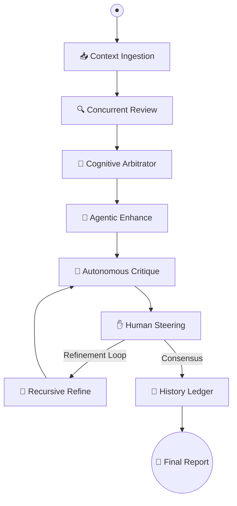

# 🤖 GitMind: The Autonomous Cognitive Code Sentinel

<p align="center">
  
</p>

[](https://github.com/langchain-ai/langgraph)
[](https://angular.dev/)
[](https://fastapi.tiangolo.com/)
[](https://deepseek.com/)

**GitMind** is an enterprise-grade **Autonomous DevOps Engine** that transforms traditional code reviews into a multi-agent cognitive process. Orchestrated by **LangGraph**, GitMind doesn't just scan for syntax—it reasons through architectural implications, identifies deep security vulnerabilities, and synthesizes production-ready remediation patches through a self-correcting feedback loop.

---

## ⚡ Cognitive Architecture: Beyond Static Analysis

GitMind eliminates the volatility of "one-shot" AI responses by leveraging a **Cyclic Multi-Agent System**:

- **🧠 Triple-Pass Arbitration:** Simultaneous review by independent **Security Auditors**, **Performance Engineers**, and **Style Guardians**, synthesized by a senior **Arbitrator** to eliminate hallucinations.
- **🛠️ Autonomous Remediation:** Not just comments—GitMind generates **atomic code patches**, **exhaustive unit test suites**, and **Mermaid.js architecture diagrams** in any PR context.
- **✋ State-Persistence HITL:** Checkpointing via **SQLite** allows the agentic graph to pause for "Human-in-the-Loop" feedback, refining its logic based on direct developer steering.
- **🚀 Neural HUD Interface:** A zoneless **Angular 19 Signals** architecture delivers a real-time, high-fidelity experience with sub-millisecond reactivity.

---

## 💎 Technical Pillars

| Pillar | Capability | Intelligence Layer |
| :--- | :--- | :--- |
| **Security Sentinel** | Scans for SQLi, XSS, Secret Leaks, and SSRF pattern matching. | DeepSeek-R1 / GPT-4o |
| **Performance Audit** | Detects memory leaks, N+1 queries, and O(n^2) complexity bottlenecks. | Claude 3.7 Sonnet |
| **Auto-Remediation** | Generates production-ready patches with direct GitHub push integration. | Gemini 1.5 Pro |
| **Semantic Cache** | Instant retrieval for identical code patterns across PR history. | SHA-256 Vector Hashing |
| **Architecture RAG** | Synthesizes Mermaid.js dependency graphs from raw file diffs. | LangGraph Arch-Node |

---

## 🧠 The Orchestration Pipeline

The GitMind brain is a **Cyclic Directed Acyclic Graph (DAG)** that facilitates non-linear reasoning and iterative refinement.



---

## 🛠 Project Blueprint

```text
GitMind/
├── backend/                # Intelligence Layer (Python 3.11+)
│   ├── agent.py            # LangGraph Orchestration & 8-node logic
│   ├── auto_fix.py         # Patch Synthesis & Staging Engine
│   ├── arch_review.py      # Mermaid Diagram Synthesis Node
│   ├── history.py          # SQLite persistence & Audit Ledger
│   └── main.py             # FastAPI Streaming & SSE Hub
├── frontend/               # Presentation Layer (Angular 19)
│   ├── src/app/features/   # Signals-based Component Modules
│   ├── src/styles.css      # Neural Glass UI Design System
│   └── public/             # High-impact Assets
└── README.md               # Sentinel Manifest
```

---

## ⚙️ Deployment & Synergy

### 1. Environment Configuration
Create a `.env` in the `backend/` directory:
```env
OPENAI_API_KEY=your_key
GEMINI_API_KEY=your_key
GITHUB_TOKEN=your_pat
```

### 2. Launch Sequence
```bash
# Start the Core Intelligence (Terminal 1)
cd backend && pip install -r requirements.txt && python main.py

# Start the Reactive HUD (Terminal 2)
cd frontend && npm install && npm start
```

---

## 🗺 Strategic Roadmap

- [x] **Phase I:** LangGraph Core & Multi-Node Arbitration.
- [x] **Phase II:** Agentic Auto-Fixes & GitHub Checkpoint API.
- [x] **Phase III:** Semantic Caching & Per-User History Ledger.
- [ ] **Phase IV:** OAuth2 Federated Identity & Team Workspace Analytics.
- [ ] **Phase V:** Local RAG indexing for full-codebase cross-referencing.

---
*Built for the high-velocity engineering teams of tomorrow.*
