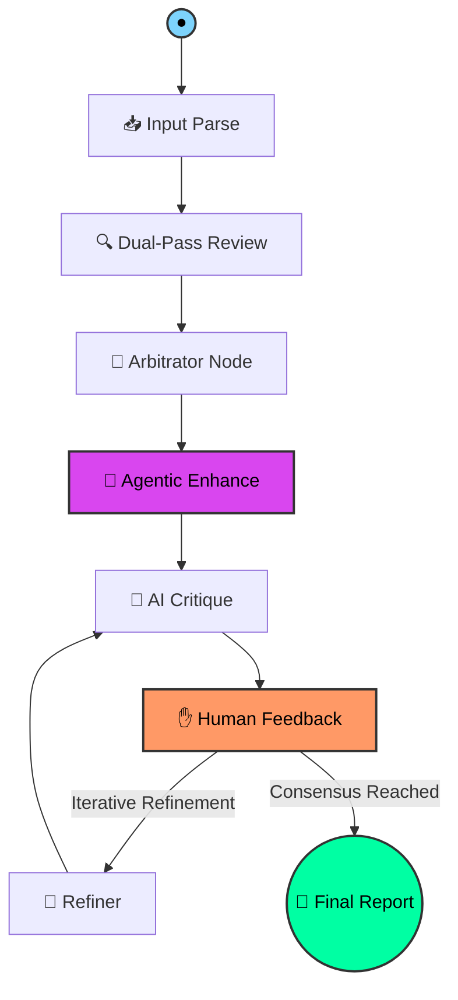

# 🤖 GitMind: The Autonomous Cognitive Code Reviewer

<p align="center">
  
</p>

[](https://github.com/langchain-ai/langgraph)
[](https://angular.dev/)
[](https://fastapi.tiangolo.com/)
[](https://opensource.org/licenses/MIT)

**GitMind** is a state-of-the-art **Autonomous Reasoning Platform** designed to revolutionize the software development lifecycle. Beyond simple static analysis, GitMind employs a **Multi-Agent Cognitive Architecture** orchestrated by **LangGraph**, simulating a rigorous, peer-reviewed engineering process. It doesn't just scan code—it understands it, critiques itself, generates fixes, and visualizes architecture in real-time.

---

## ⚡ Cognitive Superiority: Why GitMind?

GitMind eliminates the volatility of "one-shot" AI responses by leveraging a **Self-Correcting Distributed System**:

- **🧠 Multi-Agent Arbitration:** A three-tier hierarchy featuring independent **Security Auditors** and **Quality Engineers**, synthesized by a senior **Arbitrator** to eliminate hallucinations.
- **🛠️ Agentic Synthesis:** Goes beyond comments by generating **production-ready code patches**, **exhaustive unit test suites**, and **dynamic Mermaid architecture diagrams**.
- **✋ Deep Human-in-the-Loop:** State-persistence via **SQLite Checkpointing** allows the agent to pause execution, wait for developer intent, and resume with updated context.
- **💬 Contextual Intelligence:** Discussion-aware engine that fetches and reconciles existing PR comments, ensuring the AI aligns with established human consensus.
- **🚀 Zero-Latency UX:** A zoneless **Angular 20 Signals** architecture provides a real-time, high-fidelity experience with zero DOM overhead.

---

## 🧠 The Orchestration Engine: 8-Stage Pipeline

The GitMind brain is a **Cyclic Directed Acyclic Graph (DAG)** that facilitates non-linear reasoning and iterative refinement.



### Cognitive Phases:
1.  **Ingestion & Prioritization:** Structures diffs and prioritizes critical source logic over boilerplate and lock files.
2.  **Concurrent Analysis:** Parallel execution of security-focused and performance-focused review passes.
3.  **Synthesis & Arbitration:** Deduplicates cross-perspective findings and assigns empirical confidence scores.
4.  **Agentic Enhancement:** Synthesizes **Auto-Fixes**, **Unit Tests**, and **Dependency Visualizations**.
5.  **Autonomous Critique:** A "Critic" node validates the report for accuracy, tone, and actionability.
6.  **Persistence & Resumption:** The graph state is snapshotted to SQLite, enabling long-running human-in-the-loop interactions.

---

## 🚀 Advanced Capabilities

| Pillar | Technical Implementation |
| :--- | :--- |
| **Agentic Auto-Fix** | Minimal-diff patch generation with **One-Click GitHub Application**. |
| **Architecture RAG** | Dynamic generation of **Mermaid.js** diagrams to visualize module coupling changes. |
| **Cognitive Monologue**| Real-time SSE streaming of the agent's internal reasoning directly to the UI. |
| **Repo-Level Config** | `.gitmind.yaml` support for path-specific rules and severity thresholds. |
| **Stateful Persistence**| Thread-safe history browsing via **langgraph-checkpoint-sqlite**. |

---

## 🛠 Project Architecture

```text
GitMind/
├── backend/                # Cognitive Backend (Python 3.10+)
│   ├── agent.py            # LangGraph Orchestration & 8-node logic
│   ├── auto_fix.py         # Patch Synthesis Engine
│   ├── test_gen.py         # Unit Test Generation Logic
│   ├── arch_review.py      # Mermaid Diagram Synthesis
│   ├── history.py          # SQLite persistence & Session Management
│   └── diff_parser.py      # Prioritized Context Building
├── frontend/               # Reactive Frontend (Angular 20)
│   ├── src/app/            # Signals-based Component Architecture
│   ├── src/styles.css      # Cyberpunk UI & Thinking Block Animations
│   └── package.json        # High-performance toolchain
└── README.md               # You are here
```

---

## ⚙️ Execution & Setup

### 1. Prerequisites
- **Python:** 3.10+ | **Node.js:** 20+ | **NPM:** 10+

### 2. Deployment
```bash
# Terminal 1: Backend Cognitive Layer
cd backend && pip install -r requirements.txt && python main.py

# Terminal 2: Frontend Reactive Layer
cd frontend && npm install && npm start
```
Access the neural interface at `http://localhost:4200`.

---

## 🗺 Roadmap

- [x] **v1.0:** LangGraph Core & Basic Review.
- [x] **v1.5:** Dual-Pass Arbitration & SQLite Persistence.
- [x] **v2.0:** Agentic Enhancements (Auto-fix, Tests, Diagrams).
- [ ] **v2.5:** OAuth2 GitHub Integration & Multi-Repo Context.
- [ ] **v3.0:** Local RAG indexing for full-codebase architectural awareness.

---
*Built for the engineers of tomorrow. Empowering high-velocity development through cognitive automation.*
