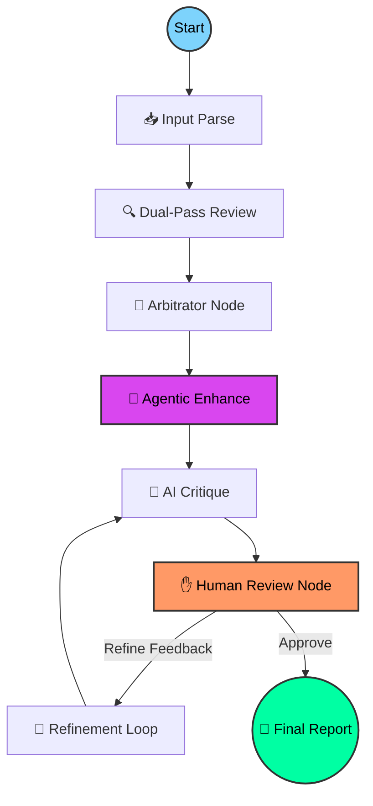

# 🤖 GitMind: The Self-Correcting AI Code Reviewer

<p align="center">
  
</p>

[](https://github.com/langchain-ai/langgraph)
[](https://angular.dev/)
[](https://fastapi.tiangolo.com/)
[](https://opensource.org/licenses/MIT)

**GitMind** is a next-generation, autonomous code review platform powered by **LangGraph** and a cyclic **Agentic Reasoning Engine**. It transcends traditional static analysis by employing a multi-agent reasoning loop that mimics a senior engineer's review process—detecting vulnerabilities, generating auto-fix patches, and visualizing architecture through a self-correcting cognitive pipeline.

---

## ⚡ Why GitMind?

GitMind solves the "one-shot" AI hallucination problem through a multi-perspective, stateful reasoning process:

- **🧠 Triple-Agent Pipeline:** Simultaneously runs independent **Security Auditor** and **Quality Engineer** passes, arbitrated by a senior **Logic Controller**.
- **🛠️ Agentic Capabilities:** Beyond just "comments," GitMind generates **concrete code patches**, **unit tests**, and **architectural diagrams** (Mermaid) for every PR.
- **✋ Human-in-the-Loop (HITL):** Built-in interruption points allow developers to steer the agent mid-process or refine suggestions via natural language.
- **💬 Discussion-Aware:** Fetches existing human discussion from GitHub PRs to ensure the agent doesn't repeat or contradict what has already been discussed.
- **💾 Stateful Persistence:** SQLite-backed persistence for both execution threads and analysis history, allowing you to browse past reviews.
- **🚀 Live "Thinking" Block:** A real-time, animated UI component that streams the agent's internal monologue and decision-making process.

---

## 🧠 Core Intelligence: The Reasoning Loop

GitMind's orchestration is managed by **LangGraph**, providing a robust framework for complex, cyclic reasoning paths.



### The 8-Stage Pipeline:
1.  **Input Parse:** Fetches diffs, loads `.gitmind.yaml`, and builds a prioritized, structured context.
2.  **Dual-Pass Review:** Concurrent execution of **Security Auditor** and **Quality Engineer** passes.
3.  **Arbitrator:** Merges both passes, deduplicates findings, and assigns cross-perspective confidence scores.
4.  **Agentic Enhance:** Generates **Auto-Fix patches**, **Unit Tests**, and **Mermaid Architecture Diagrams**.
5.  **AI Critique:** A dedicated "Critic" agent checks the report for hallucinations and tone accuracy.
6.  **Human Interruption:** The graph pauses, allowing developers to steer the analysis.
7.  **Refinement:** The "Refiner" agent reconciles all findings with AI critique and human input.
8.  **Auto-Save:** Reviews are automatically persisted to the SQLite history database.

---

## 🚀 Key Features & Capabilities

| Feature | Technical Implementation |
| :--- | :--- |
| **Agentic Auto-Fix** | Generates minimal, safe patches for findings with a **One-Click Apply** button to GitHub. |
| **Test Generation** | Analyzes changed functions and generates **Jest/Pytest/JUnit** tests automatically. |
| **Architecture Visualization**| Produces **Mermaid.js** diagrams showing dependency changes and module relationships. |
| **Thinking Visualization**| Real-time streaming UI using **Angular 20 Signals** and **FastAPI SSE**. |
| **Stateful Memory** | `SqliteSaver` checkpointer ensures session persistence across restarts. |
| **Discussion-Aware** | Integrated PR comment fetching via GitHub REST API to avoid redundant feedback. |

---

## 🛠 Configuration (.gitmind.yaml)

Customize the review experience by placing a `.gitmind.yaml` in your repository root:

```yaml
# GitMind Project Configuration
model: "gemini-2.0-flash-pro"
provider: "gemini"
severity_threshold: "medium" 
ignore_paths:
  - "dist/**"
  - "node_modules/**"
custom_instructions: |
  We follow strict Functional Programming principles. 
  Flag any use of mutable state or 'let' keywords.
```

---

## 📂 Project Architecture

```text
GitMind/
├── backend/                # FastAPI Application
│   ├── agent.py            # LangGraph Core (8-node pipeline)
│   ├── auto_fix.py         # Patch Generation Logic
│   ├── test_gen.py         # Unit Test Synthesis
│   ├── arch_review.py      # Mermaid Diagram Orchestration
│   ├── history.py          # SQLite Persistence Layer
│   ├── schemas.py          # Pydantic State & Report Definitions
│   └── requirements.txt    # Async-optimized deps
├── frontend/               # Angular 20 Application
│   ├── src/app/            # Reactive Signal Components
│   ├── src/styles.css      # Cyberpunk UI & Thinking Block Animations
│   └── package.json        # Frontend Toolchain
└── README.md               # Documentation
```

---

## ⚙️ Installation & Setup

### 1. Prerequisites
- **Python:** 3.10+ | **Node.js:** 20+ | **NPM:** 10+

### 2. Quick Start
```bash
# Terminal 1: Backend
cd backend && pip install -r requirements.txt && python main.py

# Terminal 2: Frontend
cd frontend && npm install && npm start
```
Navigate to `http://localhost:4200` to start your first review.

---

## 🤝 Contributing

We are building the future of autonomous software engineering. Join us!
1. Fork the repository | 2. Create feature branch | 3. Push changes | 4. Open PR.

---
*Developed with 🚀 by the GitMind Team. Empowering developers through intelligent automation.*
